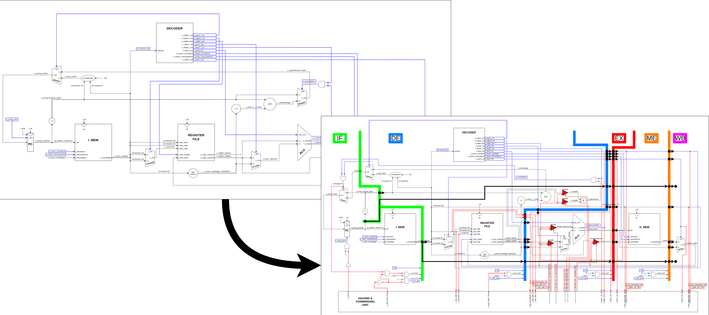

What's this?
------------

Small in-order, single-issue pipelined processor made for the Processor Architecture subject (MIRI-HPC master's at UPC), following a custom small ISA proposed for the subject's final project. Made from scratch, from a single-cycle processor to a fully-pipelined version, step-by-step and documented, for educational purposes. Sanity-check kernels and benchmarks are included to verify the correct funcioning of the processor and tinker around with it.

What source materials were used to make this?
---------------------------------------------

Subject's slides were used, which were heavily inspired, in turn, by the Hennessy-Patterson and Patterson-Hennessy diagrams, figures and explanation flow. However, in my personal view, David and Sarah Harris' book [Digital Design and Computer Architecture](https://pages.hmc.edu/harris/ddca/) provides a much simpler, easier-to-follow step-by-step design process on how to build a pipelined processor and the necessary considerations throughout. I followed the "basic" book, as I didn't need to deal with ARM or RISC-V specifics. However, if the "basic" book is anything to go by, the ARM- and RISC-V-oriented versions will also prove to be an **_amazing_**, **_wonderful_**, **_instrumental_** resource for inexperienced, noobie students such as myself.

See [David Harris' personal webpage](https://pages.hmc.edu/harris/) for per-chapter/lecture slides and code examples. Chapter 7 is the one building the entire processor, but other chapters I had some time to skim were also an absolute hoot to go over. His other book with Neil Weste [CMOS VLSI Design](http://pages.hmc.edu/harris/cmosvlsi/4e/index.html) is also an **_incredible_** read for anyone with more of a lower-level, electronics background.

What to take a look at to understand stuff
------------------------------------------

The "mymips.drawio" and "step.by.step.proc.pdf" files provided lay out a step-by-step extension process of how to go from the single-cycle version of the processor to the fully-functional pipelined version. Each tab/slide of either file is aptly named/titled to refer to the motivation and purpose behind each extension step (note on drawio usage: Ctrl+Shift+H to centre the design in the window of drawio and thus see each transition from a sort of "fix-framed" position).

All signals and modules depicted in the "mymips.drawio" and "step.by.step.proc.pdf" files are named after their actual implementation in code, i.e. ...

**_YOU CAN CTRL+F THE NAME OF A SIGNAL/MODULE IN ANY .vhd FILE AS EXPLICITLY-STATED IN THE DIAGRAMS :)_**

The initial single-cycle version of the processor corresponds to the "datapath.vhd" file (simulated with the "datapath_tb.vhd" file) and the final pipelined version resides in the "datapath_PP{,_tb}.vhd" files. All modules have dedicated testbenches to verify their functionality, and most of them vary significantly from the original examples provided in [CMOS VLSI Design](http://pages.hmc.edu/harris/cmosvlsi/4e/index.html) and [Digital Design and Computer Architecture](https://pages.hmc.edu/harris/ddca/) as a result of tinkering, refactoring and fixing of code/stuff. I used Vivado 2022.1, but I have not used any novel VHDL 2008 features that might break stuff (as was the case in Vivado), so any tool really should do the trick.

As mentioned in the previous section, Chapter 7 of David and Sarah Harris' book [Digital Design and Computer Architecture](https://pages.hmc.edu/harris/ddca/) is the thing to go for, as well as the slides.

On the final report "report.pdf" file
-------------------------------------

**DISCLAIMER**: the report was written with the subject's professor being the sole audience in mind. It can be a little tedious and convoluted if read before having checked the "step.by.step.proc.pdf" presentation or if not familiar with ISA encoding.

The "report.pdf" file containts the final report handed-in to the professor. Not much in the way of explaining how the processor works or is implemented. Instead, it details the specific modifications made to the proposed ISA and/or hardware blocks according to personal preferences/idiosincrasies. It is, essentially, a compilation of notes directed at the subject's professor to show that I had a thorough understanding of everything I had the chance of playing aound with through the course of the project.

**_HOWEVER_**, the report does contain the ISA encoding and definitions of instructions, as well as explanations of all the sanity-check programs and benchmarks used to confirm the correct functioning of the processor. They include:

  - A simple a instruction-checker
  - A Fibonacci-number program
  - A buffer-sum
  - A mem-copy
  - A matrix-multiply

All programs are shown in C, in their assembly implementation format, as well as the expected contents of imem for the sanity-checkers (see "loadimem.sh" script for further details on how "imem.dat" is loaded from the assembly programs in "asmtoisa.py").
